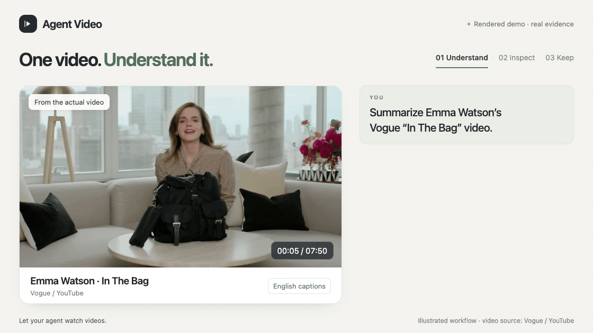

<h1 align="center">Agent Video</h1>
<p align="center"><strong>Let your agent find and watch videos.</strong></p>

<p align="center">
  <a href="https://github.com/russeell/Agent-Video/actions/workflows/test.yml"></a>
  <a href="INSTALL.md"></a>
  <a href="LICENSE"></a>
</p>

<p align="center">
  English · <a href="README.md">简体中文</a> · <a href="INSTALL.md">Install</a> · <a href="UPDATE.md">Update</a> · <a href="SKILL.md">Agent Skill</a>
</p>

Let your AI agent **find videos, understand their content, extract transcripts, and save audio or video**. Start with a video link, a local file or a description of what you need.

## Example walkthrough



*Animation made from verified outputs, not a raw session recording. Material acquisition waits are omitted.*

With this [Dragon Ball clip](https://www.bilibili.com/video/BV1X5411b7xA/): explain what's happening from sampled frames → show a clear frame at **01:48** → save the **1080p video with audio**. Follow-ups reuse the saved materials.

## What you can do

| What you need | Ask your agent |
|---|---|
| **Find videos** by topic and requirements | “Find a short Blender tutorial with an on-screen demonstration.” |
| **Understand the content** from speech and visuals | “Summarize this video and explain the key points.” |
| **Extract a transcript** with timestamps | “Extract what's said in this video, with timestamps.” |
| **Inspect a moment** with a clear screenshot of UI, code or charts | “What does this video show at `<timestamp>`? Give me a clear screenshot.” |
| **Save audio** as a separate file | “Save just the audio from this video.” |
| **Download video** in the best available quality, or save a selected clip | “Download this video in the best available quality.” |
| **Ask follow-ups** using the same saved materials | “Using that transcript, explain the second point.” |

Finding videos uses your agent's [available search tools](SEARCH.md), with checks based on your requirements. Content claims are based on text or frames your agent has actually read.

Need only a file? Request it directly. Materials are saved and reused for follow-ups, extra screenshots and file delivery.

## Install

Use it with an AI agent that can run commands and read text and images. Register the Skill if your host supports it, or use the CLI directly. Copy this message to your agent:

```text
Install Agent Video by following this guide:
https://raw.githubusercontent.com/russeell/Agent-Video/main/INSTALL.md
```

Requires **Python 3.11+** and **FFmpeg**. The [installation guide](INSTALL.md) covers setup, Windows and optional speech-to-text.

## Update

Copy this message to your agent:

```text
Update my existing Agent Video installation by following this guide:
https://raw.githubusercontent.com/russeell/Agent-Video/main/UPDATE.md
```

The [update guide](UPDATE.md) preserves your existing setup and saved files.

## Supported sources

**v0.1 is an early release.** Support varies by platform and video; some links may still fail.

| Source | What works today |
|---|---|
| **Local files** | Read subtitles, take screenshots, and export audio, video or a selected clip |
| **YouTube** | Experimental: read captions and download public videos and Shorts; 1080p downloads tested |
| **Bilibili** | Read available captions and download public videos, including a chosen part; 1080p downloads tested |
| **TikTok** | Experimental: transcripts, downloads and screenshots tested on two public videos |
| **Douyin** | Experimental: information, 1080p downloads with audio and screenshots tested; requires [Chrome or Chromium](INSTALL.md#douyin) |
| **Instagram** | Experimental: public Reel download with audio and screenshots tested; anonymous page reading may need [Chrome or Chromium](INSTALL.md#douyin) |
| **X / Twitter** | Experimental: attached-video downloads, screenshots and reuse tested |
| **Weibo** | Experimental: single posts and TV pages tested, including a 1080p download |
| **Dailymotion** | Experimental: 1080p download with audio, screenshots and reuse tested |
| **TED** | Native captions, download with audio, screenshots and reuse tested; some HLS variants are unsupported |
| **Twitch** | Experimental: public clips tested at 1080p; completed-VOD information and stream discovery tested, full VOD download unverified |
| **Pornhub** | Experimental: public MP4 download with audio and reuse tested; some HLS endpoints remain unavailable |
| **Vimeo** | Information and captions tested; tested video streams were encrypted or access-restricted, so downloads remain unverified |
| **Reddit** | Experimental: native-video downloads, screenshots and reuse tested, including videos without audio |
| **Kuaishou** | Experimental: public works and share links tested, including 720p downloads with audio, screenshots and reuse |
| **Xiaohongshu** | Experimental: tested notes redirected to unavailable or security pages; information and downloads remain unverified |
| **WeChat Channels** | Experimental: public share-link information tested; playback-link and user-supplied Yuanbao Cookie paths implemented, downloads remain unverified ([setup](INSTALL.md#wechat-channels)) |

Public links can still require authentication or verification. Netflix, Facebook, unknown websites, direct media links, live streams and DRM-protected videos are not supported. Downloaded files can be used as local input.

Bilibili supporter-only videos require an account with access and an explicitly supplied Cookie file; a public video page does not guarantee public playback.

Subtitles are used first. If none are available, optional speech-to-text can transcribe the audio. Transcripts may contain errors or cover only part of a video; screenshots show selected moments.

<details>
<summary><strong>Use the command line</strong></summary>

After installation, run from the project directory:

```bash
# Get a transcript
.venv/bin/agent-video "<video-url-or-local-file>" --get transcript

# Save the audio
.venv/bin/agent-video "<video-url-or-local-file>" --get audio

# Get a clear screenshot using the saved manifest
.venv/bin/agent-video --evidence "/path/to/manifest.json" --get frames --at 00:10 --width 0 --quality source

# Download a video directly
.venv/bin/agent-video "<video-url>" --get video
```

Choose a time within the video's duration for `--at`. `--get` accepts `info,transcript,frames,audio,video`, separately or together. Files are saved in `.agent-video/` by default. The command returns JSON with file paths and a `manifest.json`; use `--evidence` to reuse its materials for follow-ups or downloads. Exit code `2` means partial success; completed files remain usable.

See `--help` for time ranges, language, quality, video parts and Cookie files; `--version` shows the installed version. Windows uses `.venv\Scripts\agent-video.exe`.

</details>

## Contributing

Found a broken link or confusing behavior? [Open an issue](https://github.com/russeell/Agent-Video/issues) with a public video link, what you wanted to do, your OS / agent, the `--version` output and the returned `status` / `diagnostics`. Leave out cookies, private links and signed download addresses.

For code changes, install the project and FFmpeg, then run the tests:

```bash
.venv/bin/python -m unittest discover -s tests -v
```

These tests run offline. Check real downloads or speech-to-text separately when changing those features.

## License

[MIT](LICENSE).
